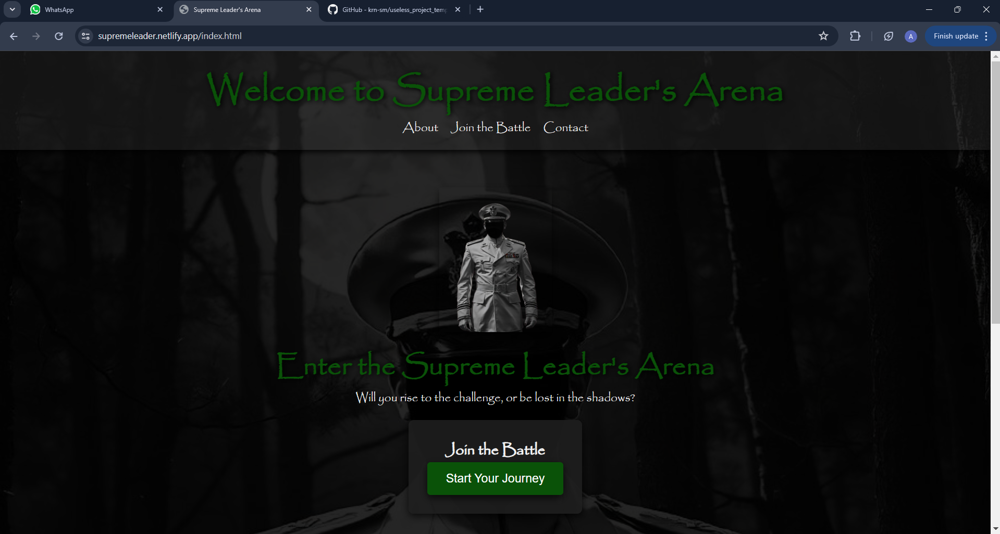
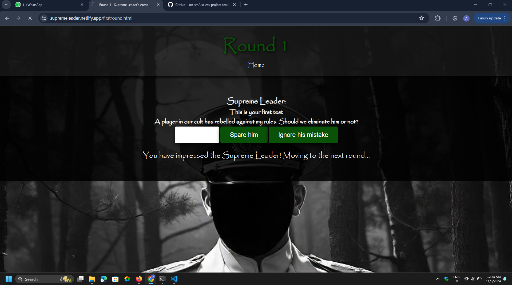
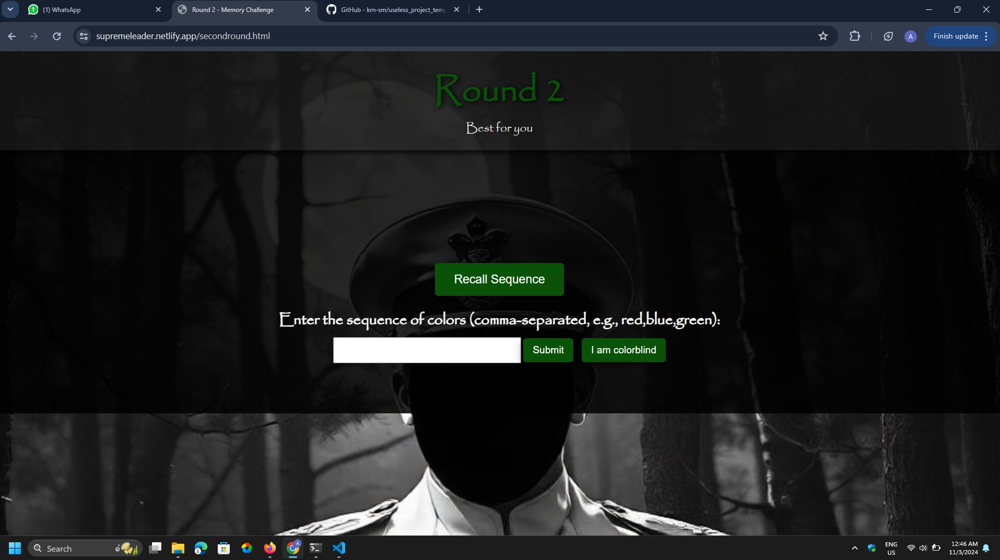
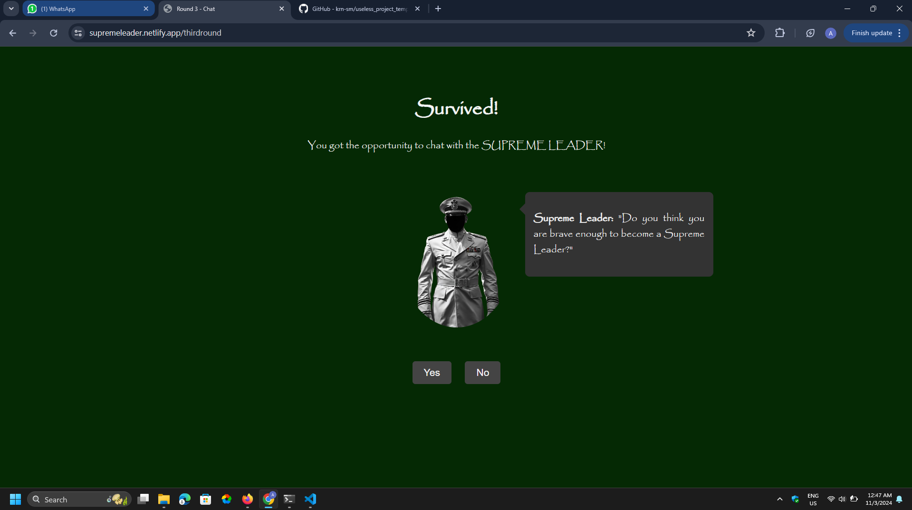
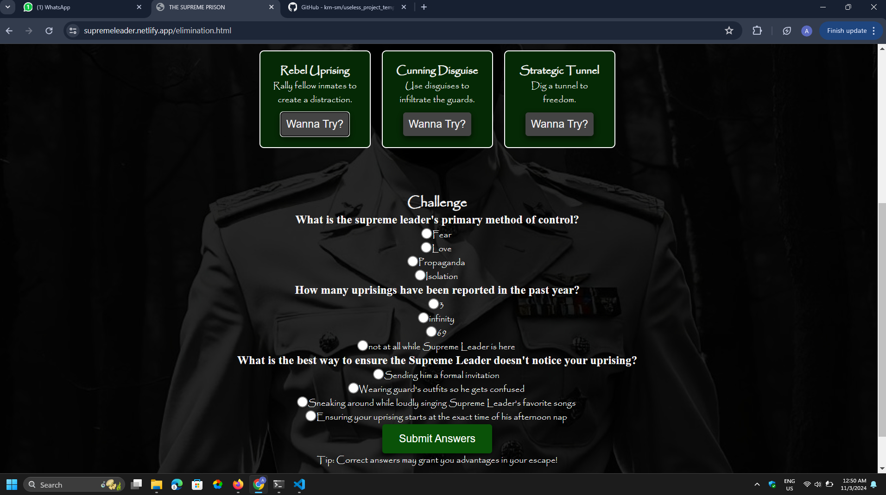
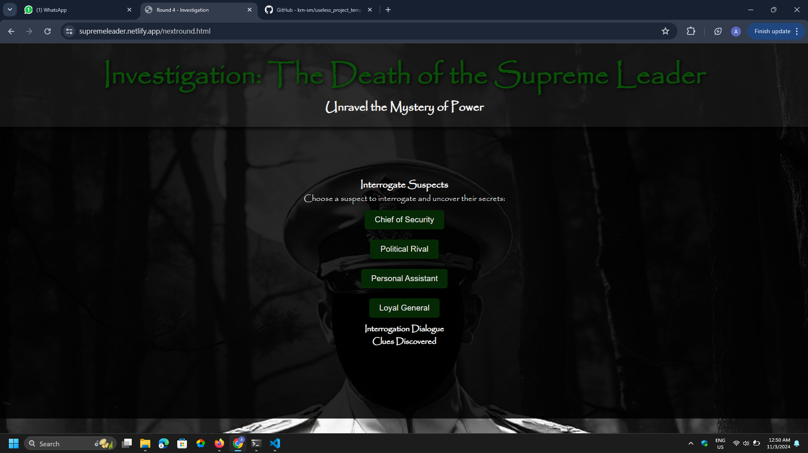
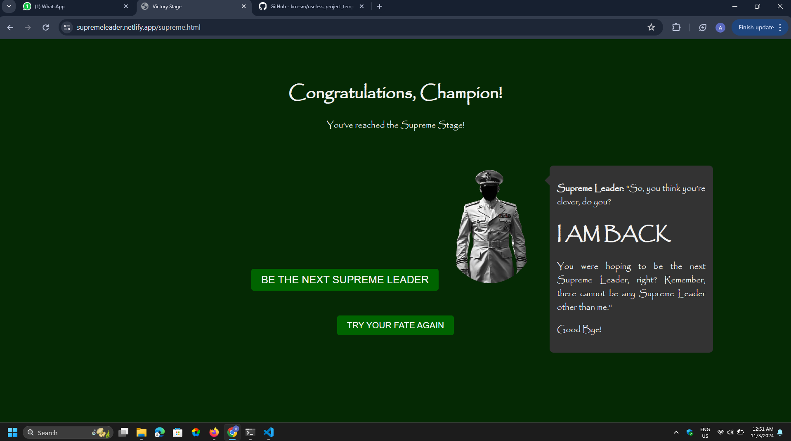

# SUPREME LEADER 🎯

## Basic Details

### Team Name: G SQUAD

### Team Members

- Team Lead: AKSHAY S - NSS COLLEGE OF ENGINEERING
- Member 2: KIRAN S M - NSS COLLEGE OF ENGINEERING

### Project Description

A game website which is lead by a Supreme Leader, consisting of many interesting rounds. Anyone can be eliminated anytime by the wish of the Supreme Leader. The players must complete all the rounds, to reach the ultimate stage and will be hoping to be named as the new Supreme Leader. Who knows? What's in the mind of the Supreme Leader.A winner can be a loser, a loser can be a winner.

### The Problem (that doesn't exist)

To satisfy the wish of humans to play game which means nothing, and the need that doesn't exist.

### The Solution (that nobody asked for)

Supreme Leader : This Revolutionary Game😈

## Technical Details

### Technologies/Components Used

For Software:

- HTML,CSS,JAVASCRIPT
- Netlify - deployment platform

### Implementation

For Software:

# Installation

[commands]

# Run

[commands]

### Project Documentation

For Software:

# Screenshots (Add at least 3)

This shows the homepage of our gaming website 

The given screenshots shows the game and look of the first round

This shows details about the second round

This is the 3rd round or the supreme leader's interaction with players 

The given round is about the prison break round

The final round in the game

The end of the game-Supreme Stage

### Project Demo

# Video

[Add your demo video link here]
_Explain what the video demonstrates_

# Additional Demos

[Add any extra demo materials/links]

## Team Contributions

- [Name 1]: [Specific contributions]
- [Name 2]: [Specific contributions]
- [Name 3]: [Specific contributions]

---

Made with ❤️ at TinkerHub Useless Projects

